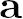
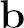
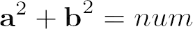
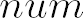
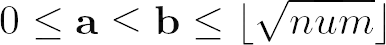
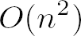
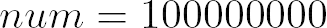

# AllSquaredPairs

Program which finds all  and , such that  for given number  and  to prevent redundant iterations.

Algorithm has time complexity  since unequality statement above implies.

## Example output

Output shown below has 

```text
[ [ 0, 10000 ], [ 2800, 9600 ], [ 3520, 9360 ], [ 5376, 8432 ], [ 6000, 8000 ] ]
```

## Note

You need Visual Studio 2022 to run this project.
